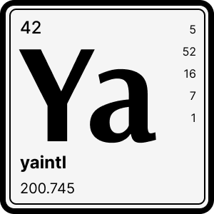

<br />
<div align="center">
  
  <h1 align="center">yaintl</h3>
  <p align="center">Yet another i18n library with ICU message syntax (tiny footprint)</p>
  <p align="center">
    
    
  	 <a href="https://codeclimate.com/github/tuplo/yaintl/test_coverage">
  	   </a>
  </p>
</div>

## Why

Other i18n solutions supporting ICU syntax were too heavy to bundle with our apps where every kb in size counts. So we wrote this stripped down to the basics solution while still supporting complex ICU syntax and a familiar API.

## Install

```bash
$ npm install @tuplo/yaintl

# or with yarn
$ yarn add @tuplo/yaintl
```

## Usage

```typescript
import I18n from '@tuplo/yaintl';

const i18n = new I18n({ 
  locale: "en-GB", 
  messages: { simple: { message: "Hi {name}!" } }
})

const t = i18n.build('simple')

t('message', { name: "Alice" }) // ⇒ "Hi Alice!"
```

## Message syntax

We use the ICU syntax to declare i18n messages. Here's a brief description of how to use this syntax.

### Plain string

```typescript
const messages = {
  hello: "Hi stranger!"
}

t('hello'); // ⇒ "Hi stranger!"
```

### Interpolation

Where placeholders in the message are replaced by given values.

#### Placeholder

```typescript
const messages = {
  desc: "{name} lives in {city}."
}

t('desc', { name: "Alice", city: "London" } ); // ⇒ "Alice lives in London."
```

#### Plural

```typescript
const messages = {
  photos: "You have {count, plural, one {# photo} other {# photos}}."
}

t('photos', { count: 1 }) // ⇒ "You have 1 photo."
t('photos', { count: 12 }) // ⇒ "You have 12 photos."
```

#### Plural with offset
```typescript
const messages = {
  adds: "{adds, plural, offset:1 =0 {No-one has added this} =1 {You added this} one {You and one other person added this} other {You and # others added this}}."
}

t('adds', { adds: 0 }); // ⇒ "No-one has added this."
t('adds', { adds: 1 }); // ⇒ "You added this."
t('adds', { adds: 2 }); // ⇒ "You and one other person added this."
t('adds', { adds: 12 }); // ⇒ "You and 11 others added this."

```

#### Ordinal
```typescript
const messages = {
  queue: "You are the {pos, selectordinal, one {#st} two {#nd} few {#rd} other {#th}}.",
}

t('queue', { pos: 1 }); // ⇒ "You are the 1st."
t('queue', { pos: 2 }); // ⇒ "You are the 2nd."
t('queue', { pos: 3 }); // ⇒ "You are the 3rd."
t('queue', { pos: 12 }); // ⇒ "You are the 12th."
```

#### Select

```typescript
const messages = {
  liked: "{gender, select, male {He} female {She} other {They}} liked this."
}

t('liked', { gender: 'male' }); // ⇒ "He liked this."
t('liked', { gender: 'female' }); // ⇒ "She liked this."
t('liked', { gender: undefined }); // ⇒ "They liked this."
```

### Formatting

Values can also be formatted based on their type by using the syntax `{variable, type, format}`. Example: `"The default value is {count, number, decimal}."`

- `variable` is the variable we pass
- `type` is how to interpret the value
- `format` is optional, and is a further refinement on how to display that type of data

#### Number

Possible values from [`style`](https://developer.mozilla.org/en-US/docs/Web/JavaScript/Reference/Global_Objects/Intl/NumberFormat/NumberFormat) option on `Intl.NumberFormat`.

```typescript
const messages = {
  num: "The default value is {count, number}.",
  perc: "The tank is at {count, number, percent} capacity.",
}

t('num', { count: 1_499 }); // ⇒ "The default value is 1,499."
t('perc', { count: 0.76 }); // ⇒ "The tank is at 76% capacity."
```

#### Date

Possible values from [`dateStyle`](https://developer.mozilla.org/en-US/docs/Web/JavaScript/Reference/Global_Objects/Intl/DateTimeFormat/DateTimeFormat) option on `Intl.DateTimeFormat`.


```typescript
const messages = {
  dt1: "Sale begins { startDate, date, short }.",
  dt2: "Sale begins { startDate, date, medium }.",
  dt3: "Sale begins { startDate, date, long }.",
  dt4: "Sale begins { startDate, date, full }.",
}

const startDate = new Date('2022-12-25');
t('dt1', { startDate }); // ⇒ "Sale begins 25/12/2022."
t('dt2', { startDate }); // ⇒ "Sale begins 25 Dec 2022."
t('dt3', { startDate }); // ⇒ "Sale begins 25 December 2022."
t('dt4', { startDate }); // ⇒ "Sale begins Sunday, 25 December 2022."
```

#### Time

Possible values from [`timeStyle`](https://developer.mozilla.org/en-US/docs/Web/JavaScript/Reference/Global_Objects/Intl/DateTimeFormat/DateTimeFormat) option on `Intl.DateTimeFormat`.


```typescript
const messages = {
  tm1: "Coupon expires at { startTime, time, short }.",
  tm2: "Coupon expires at { startTime, time, medium }.",
  tm3: "Coupon expires at { startTime, time, long }.",
  tm4: "Coupon expires at { startTime, time, full }.",
}

const startTime = new Date('2022-12-25T12:34:00.000Z');
t('tm1', { startTime }); // ⇒ "Coupon expires at 12:34."
t('tm2', { startTime }); // ⇒ "Coupon expires at 12:34:00."
t('tm3', { startTime }); // ⇒ "Coupon expires at 12:34:00 GMT."
t('tm4', { startTime }); // ⇒ "Coupon expires at 12:34:00 GMT."

```

#### List

Possible values from [`style`](https://developer.mozilla.org/en-US/docs/Web/JavaScript/Reference/Global_Objects/Intl/ListFormat/ListFormat) option on `Intl.ListFormat`.

```typescript
const messages = {
  l1: "With { team, list }.",
  l2: "With { team, list, long }.",
  l3: "With { team, list, short }.",
  l4: "With { team, list, narrow }.",
}

const team = ['Alice', 'Bob', 'Charlie'];
t('l1', { team }); // ⇒ "With Alice, Bob and Charlie."
t('l2', { team }); // ⇒ "With Alice, Bob and Charlie."
t('l3', { team }); // ⇒ "With Alice, Bob and Charlie."
t('l4', { team }); // ⇒ "With Alice, Bob, Charlie."
```

### Custom formatters

Besides the default styles from `Intl` formatters, we can use all those options to create custom formatters.

#### Number

All possible options listed at [`Intl.NumberFormat`](https://developer.mozilla.org/en-US/docs/Web/JavaScript/Reference/Global_Objects/Intl/NumberFormat).

```typescript
const formats = {
  number: {
    nf1: { notation: 'scientific' },
    nf2: { signDisplay: 'exceptZero' }  
  }
}
const messages = {
  'm1': 'The value is {count, number, nf1}.',
  'm2': 'The value is {count, number, nf2}.'
}
const i18n = new I18n({ locale: 'en-GB', messages, formats });

const count = 1_234_567_890;
t('m1', { count }) // ⇒ "The value is 1.235E9."
t('m2', { count }) // ⇒ "The value is +1,234,567,890."
```

#### Date

All possible options listed at [`Intl.DateTimeFormat`](https://developer.mozilla.org/en-US/docs/Web/JavaScript/Reference/Global_Objects/Intl/DateTimeFormat).

```typescript
const formats = {
  dateTime: {
    df1: { day: 'numeric', month: 'short' },
    df2: { month: 'long' }  
  }
}
const messages = {
  'm1': 'Sale begins {start, date, df1}.',
  'm2': 'Sale begins {start, date, df2}.'
}
const i18n = new I18n({ locale: 'en-GB', messages, formats });

const start = new Date('2022-12-25');
t('m1', { start }) // ⇒ "Sale begins 25 Dec."
t('m2', { start }) // ⇒ "Sale begins December."
```

#### Time

All possible options listed at [`Intl.DateTimeFormat`](https://developer.mozilla.org/en-US/docs/Web/JavaScript/Reference/Global_Objects/Intl/DateTimeFormat).

```typescript
const formats = {
  dateTime: {
    tf1: { timeStyle: 'short' },
    tf2: { timeStyle: 'short', timeZone: 'America/Los_Angeles' }  
  }
}
const messages = {
  'm1': 'Sale begins {start, time, tf1}.',
  'm2': 'Sale begins {start, time, tf2}.'
}
const i18n = new I18n({ locale: 'en-GB', messages, formats });

const start = new Date('2022-12-25T23:30:00.000Z');
t('m1', { start }) // ⇒ "Sale begins 23:30."
t('m2', { start }) // ⇒ "Sale begins 15:30."
```

#### List

All possible options listed at [`Intl.ListFormat`](https://developer.mozilla.org/en-US/docs/Web/JavaScript/Reference/Global_Objects/Intl/ListFormat).

```typescript
const formats = {
  dateTime: {
    lf1: { type: 'disjunction' }
  }
}
const messages = {
  'm1': 'With {team, list, lf1}.'
}
const i18n = new I18n({ locale: 'en-GB', messages, formats });

const team = ['Alice', 'Bob', 'Charlie'];
t('m1', { team }) // ⇒ "With Alice, Bob or Charlie."
```

## License

MIT